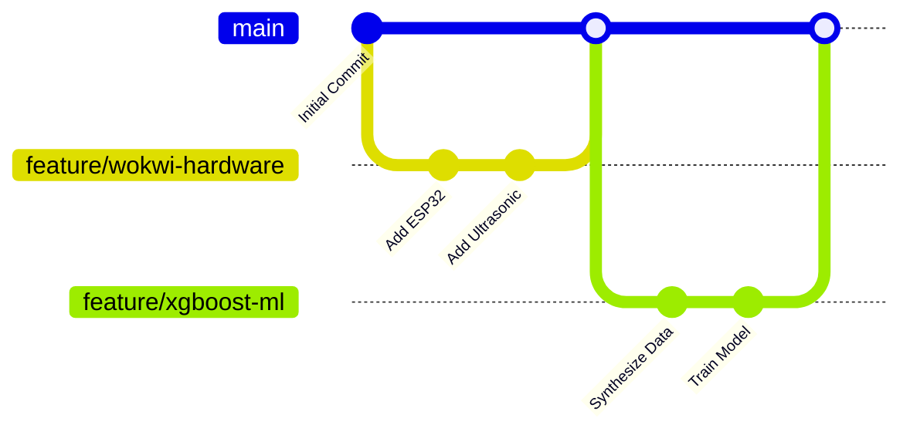

# Change Log

All notable changes to the EcoBin project will be documented in this file.

## Source Control Flow

## Detailed Changes

| Version | Date | Status | Description of Change | Author |
| :--- | :--- | :--- | :--- | :--- |
| **v1.1.0** | 2026-06-20 | Unreleased | XGBoost forecasting integration & Wokwi simulation setup. | ML Team |
| **v1.0.1** | 2026-06-18 | Released | Switched from MySQL to PostgreSQL for production scalability. | DB Admin |
| **v1.0.0** | 2026-06-10 | Released | Addressed memory leak in the CVRP solver loop. | Backend Team |
