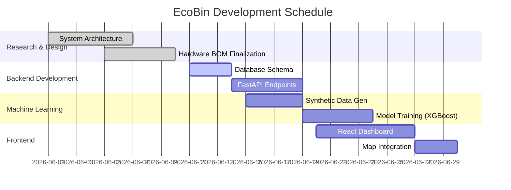

# Gantt Chart (Project Schedule)

```mermaid
gantt
    title EcoBin Development Schedule
    dateFormat  YYYY-MM-DD
    section Research & Design
    System Architecture       :done,    des1, 2026-06-01,2026-06-07
    Hardware BOM Finalization :done,    des2, 2026-06-05,2026-06-10
    section Backend Development
    Database Schema           :active,  backend1, 2026-06-11, 3d
    FastAPI Endpoints         :         backend2, after backend1, 5d
    section Machine Learning
    Synthetic Data Gen        :         ml1, 2026-06-15, 4d
    Model Training (XGBoost)  :         ml2, after ml1, 5d
    section Frontend
    React Dashboard           :         front1, 2026-06-20, 7d
    Map Integration           :         front2, after front1, 3d
```
