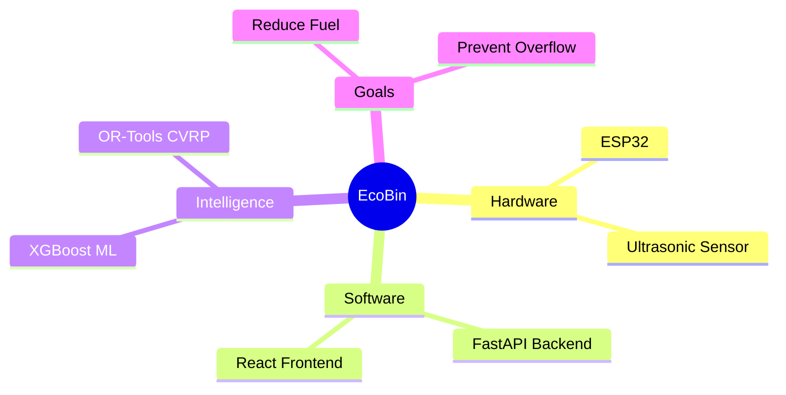

# Project Charter

## 1. Project Overview

## 2. Key Objectives & Stakeholders

| Category | Description | Primary Stakeholder | Success Metric |
| :--- | :--- | :--- | :--- |
| **Operational** | Transition to dynamic routing. | Municipal Sanitation Dept | 30% reduction in route distance. |
| **Hardware** | Hardware-in-the-loop simulation. | IoT Team | 100% simulated uptime via Wokwi. |
| **Machine Learning**| Predict bin fill levels 24h ahead. | Data Science Team | 80% precision on overflow events. |
| **Software** | Deliver intuitive dashboard. | UI/UX Team | <200ms latency on map renders. |
