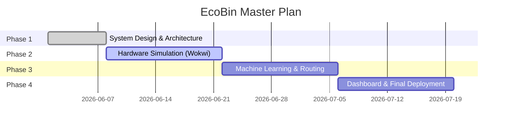

# Project Plan

## 1. Execution Strategy

## 2. Resource Allocation

| Resource Type | Specification | Assignment / Owner |
| :--- | :--- | :--- |
| **Infrastructure** | Docker Desktop, PostgreSQL, GitHub Actions | DevOps Engineer |
| **Hardware** | ESP32, HC-SR04, PIR (Simulated on Wokwi) | IoT Hardware Lead |
| **Software Tools** | Python 3.10, FastAPI, React 18 | Fullstack Developer |
| **ML Frameworks** | XGBoost, Scikit-Learn, OR-Tools | Machine Learning Engineer |
