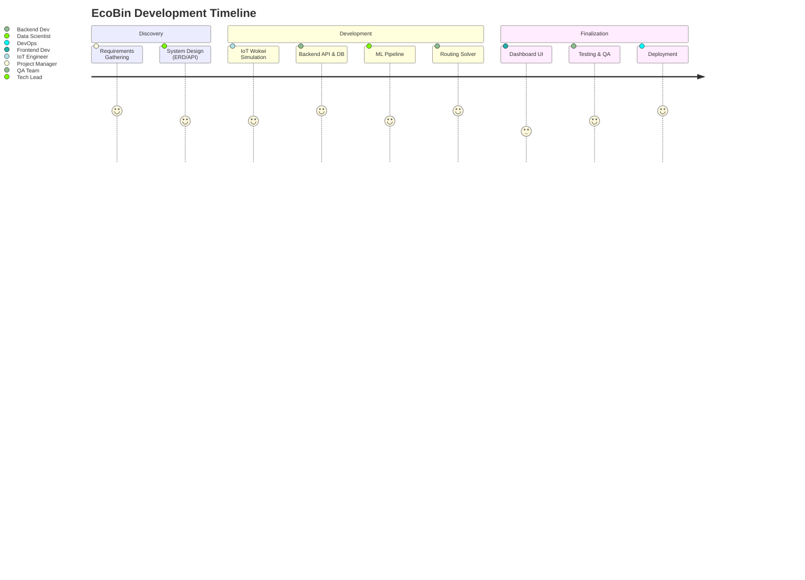

# Timeline

```mermaid
journey
    title EcoBin Development Timeline
    section Discovery
      Requirements Gathering: 5: Project Manager
      System Design (ERD/API): 4: Tech Lead
    section Development
      IoT Wokwi Simulation: 4: IoT Engineer
      Backend API & DB: 5: Backend Dev
      ML Pipeline: 4: Data Scientist
      Routing Solver: 5: Backend Dev
    section Finalization
      Dashboard UI: 3: Frontend Dev
      Testing & QA: 4: QA Team
      Deployment: 5: DevOps
```
