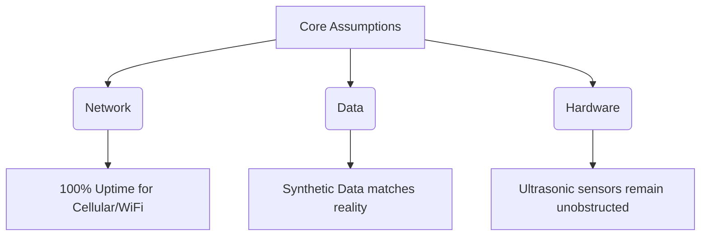

# Assumptions

## 1. Core Assumptions Flow

## 2. Detailed Assumption Matrix

| Assumption Category | Description | Impact if False | Mitigation |
| :--- | :--- | :--- | :--- |
| **Network Connectivity** | Bins are located in areas with reliable cellular/WiFi networks. | Critical: Bins cannot push data, blinding the ML model. | Implement local data caching on ESP32 until connection restores. |
| **Data Validity** | Synthetic data accurately reflects real-world waste accumulation patterns. | High: Routing engine will optimize for the wrong patterns. | Retrain model on live data after 30 days of physical deployment. |
| **Hardware Reliability** | Sensors will not be obstructed by large items placed near the top. | Medium: False positives for "full" bins. | Implement secondary weight sensors or image processing later. |
| **Driver Compliance** | Drivers will follow optimized routes without deviation. | Medium: Fuel savings won't be realized. | Add turn-by-turn navigation via a dedicated mobile app. |
