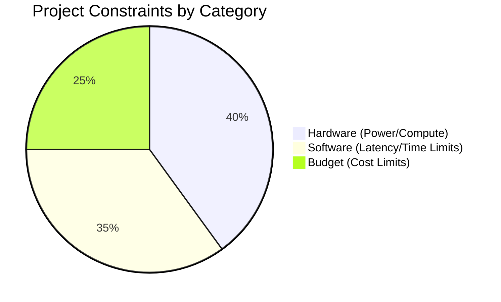

# Constraints

## 1. Constraint Distribution

## 2. Constraint Breakdown

| Constraint Category | Specific Limitation | Reason / Justification | Workaround / Solution |
| :--- | :--- | :--- | :--- |
| **Hardware** | ESP32 limited battery life (requires < 1mA sleep). | Cannot rely on municipal grid power. | Use Deep Sleep mode, waking only once per hour to push data. |
| **Hardware** | Wokwi simulator CPU bottlenecks at high scale. | Browser-based simulators cannot handle 5000+ nodes simultaneously. | Limit simulation to a 10-node cluster for UI/Integration testing. |
| **Software** | CVRP Routing must solve in < 60 seconds. | API timeouts will cause the dashboard to hang during route generation. | Set `time_limit_ms` heuristic in Google OR-Tools. |
| **Software** | SQLAlchemy ORM strictness. | Must be portable between SQLite (Dev) and Postgres (Prod). | Avoid raw SQL queries; rely entirely on SQLAlchemy models. |
| **Budget** | Zero-cost mapping APIs. | Project cannot sustain Google Maps API billing. | Utilize Leaflet and open-source Haversine distance matrix logic. |
