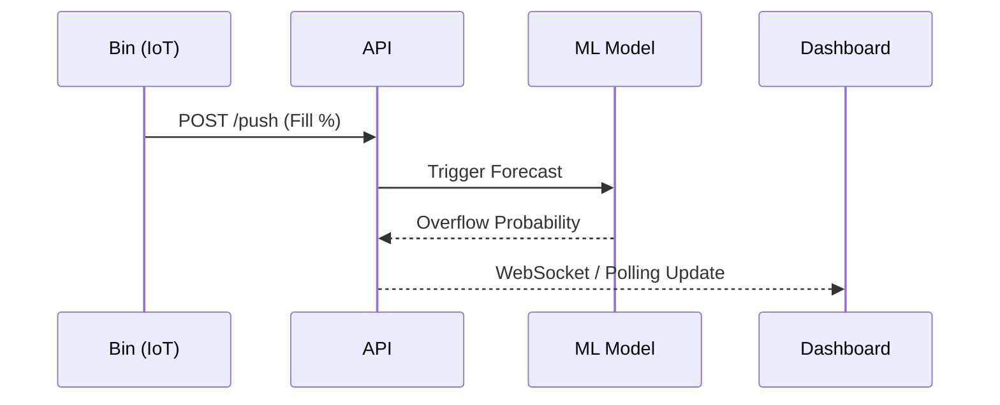

# Functional Requirements

## 1. Functional System Flow

## 2. Detailed Functional Requirements

| Req ID | Module | Requirement Description | Priority |
| :--- | :--- | :--- | :--- |
| **FR-01** | IoT | Expose `POST /api/iot/push` for payload ingestion. | Critical |
| **FR-02** | DB | Log every successful push to `fill_history`. | Critical |
| **FR-03** | ML | Forecast 24-hour fill level using XGBoost. | High |
| **FR-04** | ML | Map RMSE to normal distribution for overflow probability. | High |
| **FR-05** | Routing | Compute CVRP route for bins with Priority > 0.70. | Critical |
| **FR-06** | UI | Render bins on interactive Leaflet map. | High |
| **FR-07** | UI | Color-code bins based on priority (Red = High, Green = Low). | Medium |
