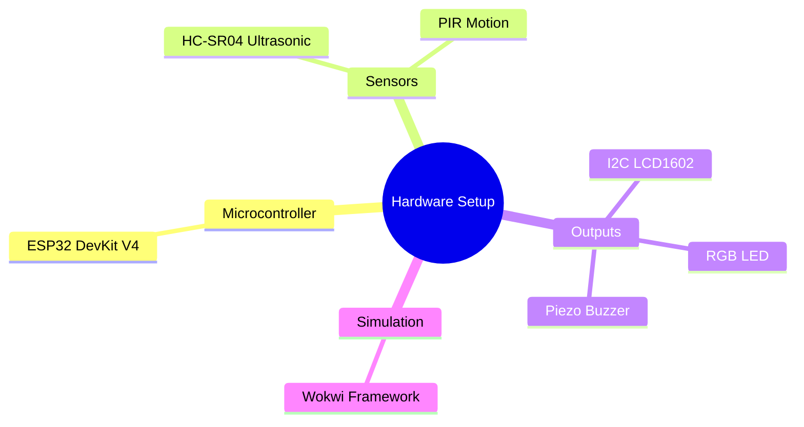

# Hardware Requirements

## 1. Hardware Stack

## 2. Detailed Specifications

| Component | Function | Required Spec | Voltage |
| :--- | :--- | :--- | :--- |
| **ESP32** | Core processing and HTTP POST via WiFi. | Xtensa Dual-Core 32-bit | 3.3V |
| **HC-SR04** | Measures distance to waste surface. | 2cm - 400cm range | 5V |
| **PIR** | Detects tampering or human proximity. | <1s response | 3.3V / 5V |
| **LCD1602** | Local diagnostics display. | I2C backpack | 5V |
| **Piezo Buzzer** | Audio alerts for critical errors. | Passive buzzer | 3.3V |
