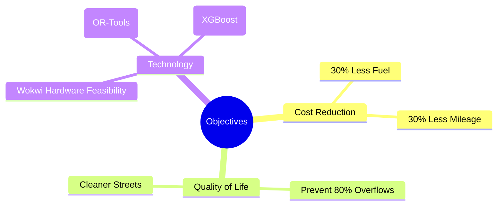

# Objectives

## 1. Objective Mapping

## 2. Objective KPIs

| Objective | Description | Target KPI | Measurement Method |
| :--- | :--- | :--- | :--- |
| **Reduce Operational Costs** | Decrease distance traveled and fuel consumed. | > 30% reduction | Compare CVRP route distance vs. fixed schedule distance in DB. |
| **Prevent Overflowing Bins** | Maintain high prevention rate using XGBoost. | 80%+ prevention | Count instances where `fill_percentage > 95%` in history. |
| **Data-Driven Operations** | Shift to dynamic, priority-based collection. | 100% adoption | All daily routes generated strictly by OR-Tools. |
| **Hardware Viability** | Prove feasibility of low-power edge nodes. | 99% Uptime | Monitor Wokwi simulator HTTP POST success rate. |
| **Operator Visibility** | Provide modern, responsive control dashboard. | < 500ms latency | Monitor UI render times using React Profiler. |
