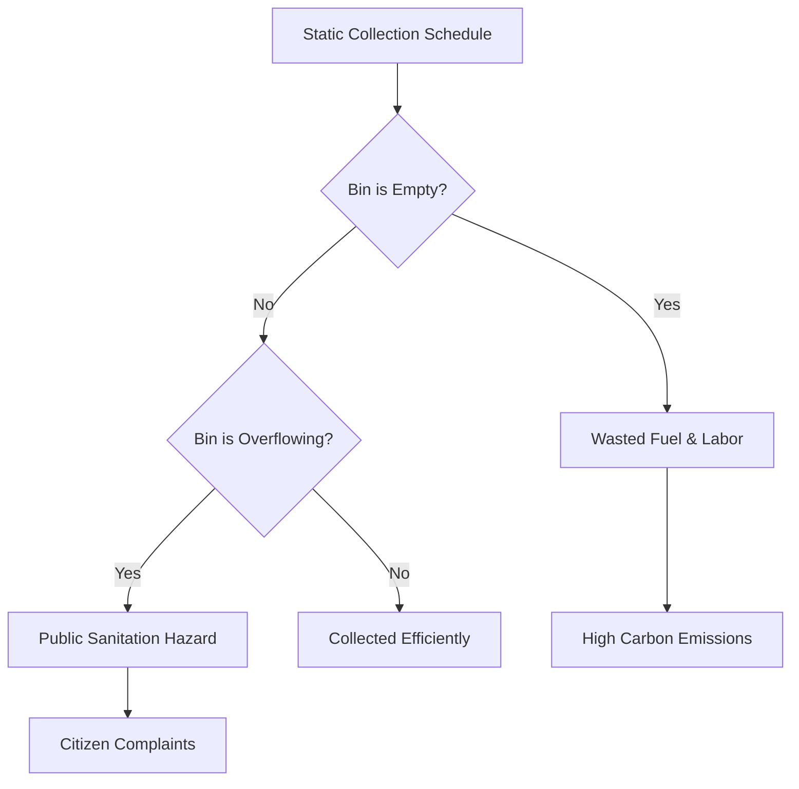

# Problem Statement

## 1. Problem Visualization

## 2. Core Issues

| Problem Area | Current State | EcoBin Solution |
| :--- | :--- | :--- |
| **Fuel Inefficiency** | Trucks drive fixed routes, visiting empty bins. | **Dynamic Routing:** Trucks only visit bins forecasted to be full. |
| **Sanitation Hazards** | Bins in commercial zones overflow before scheduled pickup. | **Proactive AI:** XGBoost predicts overflows 24h in advance. |
| **Lack of Visibility** | Operators have no real-time telemetry on bin status. | **IoT Edge Nodes:** ESP32 sensors provide hourly fill metrics. |
