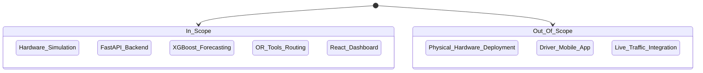

# Scope

## 1. Scope Boundary

## 2. Detailed Scope Definition

| Feature / Domain | In Scope | Out of Scope | Notes |
| :--- | :--- | :--- | :--- |
| **Hardware** | Wokwi ESP32 Simulation. | Physical deployment in municipal bins. | Cost constraints limit physical rollout for Phase 1. |
| **Data Pipeline** | FastAPI REST backend, SQLite/PostgreSQL, 4.38M synthetic records. | External data lake integration (e.g., Snowflake). | Built for vertical scaling initially. |
| **Machine Learning** | XGBoost time-series forecasting (24 hours ahead). | Computer vision/camera-based fill detection. | Relies solely on ultrasonic distance telemetry. |
| **Routing Optimization** | OR-Tools CVRP solver using Haversine distance matrix. | Live traffic APIs (e.g., Google Maps Traffic delays). | Haversine provides a sufficient baseline for proof-of-concept. |
| **Frontend UI** | React + Leaflet control room dashboard. | Dedicated iOS/Android app for truck drivers. | Route paths are currently exported as JSON for dispatch. |
