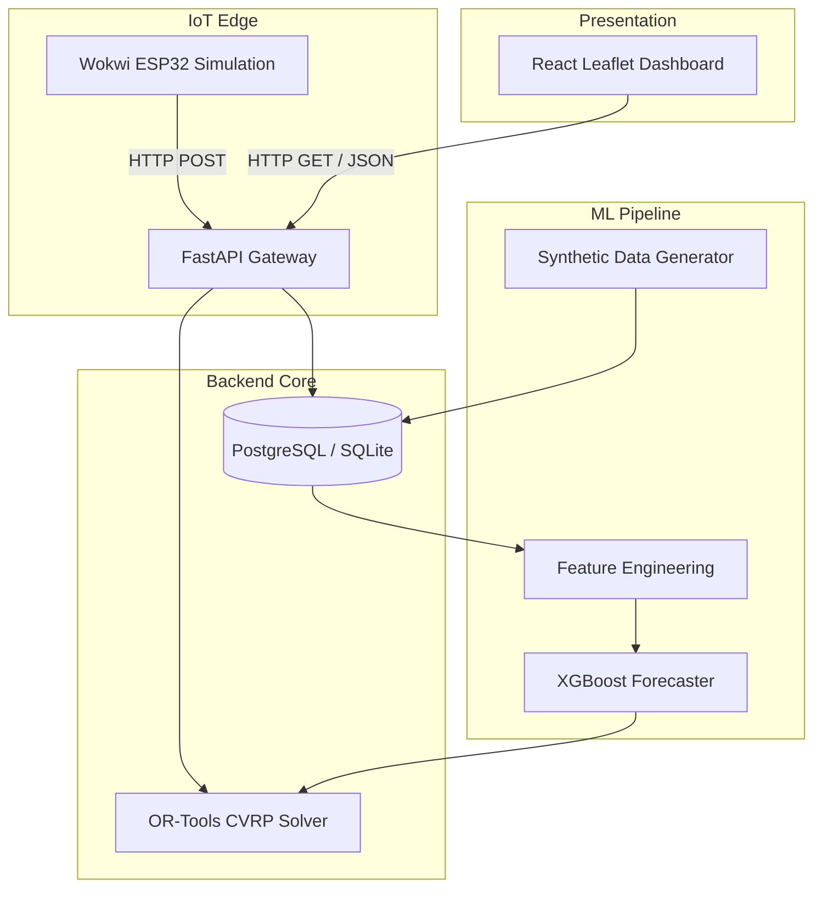
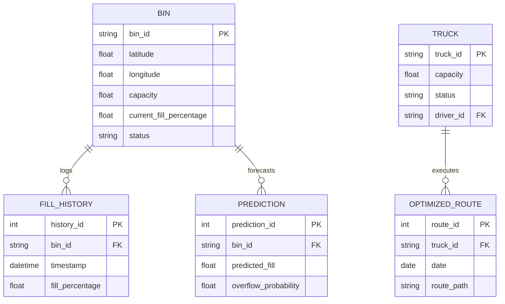

# 03 System Design

## 1. System Architecture

The EcoBin system employs a decoupled, microservice-inspired architecture.

## 2. Database Schema Design (Entity Relationship)

## 3. API Contract Highlights

- `GET /api/bins` - Retrieves all bins with real-time status and coordinates.
- `GET /api/routes/latest` - Fetches the most recently computed CVRP route paths.
- `GET /api/analytics` - Returns system evaluation metrics (AI vs Fixed Schedule).
- `POST /api/iot/push` - Endpoint for the ESP32 hardware to push new sensor readings.
