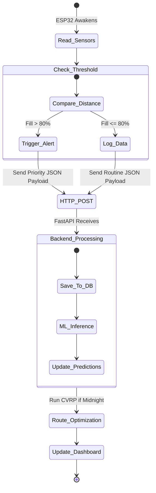

# Activity Diagram

```mermaid
stateDiagram-v2
    [*] --> Read_Sensors: ESP32 Awakens
    Read_Sensors --> Check_Threshold
    
    state Check_Threshold {
        [*] --> Compare_Distance
        Compare_Distance --> Trigger_Alert: Fill > 80%
        Compare_Distance --> Log_Data: Fill <= 80%
    }
    
    Trigger_Alert --> HTTP_POST: Send Priority JSON Payload
    Log_Data --> HTTP_POST: Send Routine JSON Payload
    
    HTTP_POST --> Backend_Processing: FastAPI Receives
    
    state Backend_Processing {
        [*] --> Save_To_DB
        Save_To_DB --> ML_Inference
        ML_Inference --> Update_Predictions
    }
    
    Backend_Processing --> Route_Optimization: Run CVRP if Midnight
    Route_Optimization --> Update_Dashboard
    Update_Dashboard --> [*]
```
