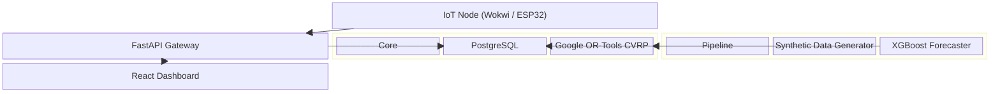

# Block Diagram

```mermaid
block-beta
    columns 3
    space
    Hardware_Layer["IoT Node (Wokwi / ESP32)"]
    space

    API_Gateway["FastAPI Gateway"]
    
    block:Backend Core
        PostgreSQL
        OR_Tools["Google OR-Tools CVRP"]
    end
    
    block:ML Pipeline
        DataGen["Synthetic Data Generator"]
        XGBoost["XGBoost Forecaster"]
    end
    
    Frontend["React Dashboard"]

    Hardware_Layer --> API_Gateway
    API_Gateway --> PostgreSQL
    API_Gateway --> Frontend
    DataGen --> PostgreSQL
    XGBoost --> OR_Tools
```
