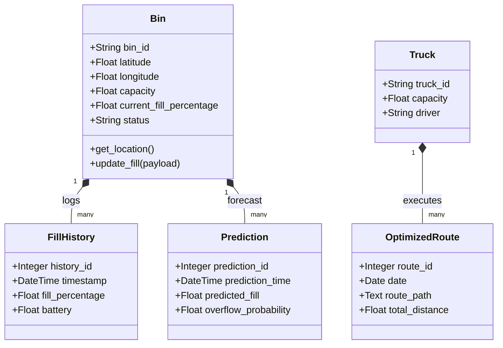

# Class Diagram

```mermaid
classDiagram
    class Bin {
        +String bin_id
        +Float latitude
        +Float longitude
        +Float capacity
        +Float current_fill_percentage
        +String status
        +get_location()
        +update_fill(payload)
    }

    class FillHistory {
        +Integer history_id
        +DateTime timestamp
        +Float fill_percentage
        +Float battery
    }

    class Prediction {
        +Integer prediction_id
        +DateTime prediction_time
        +Float predicted_fill
        +Float overflow_probability
    }

    class Truck {
        +String truck_id
        +Float capacity
        +String driver
    }

    class OptimizedRoute {
        +Integer route_id
        +Date date
        +Text route_path
        +Float total_distance
    }

    Bin "1" *-- "many" FillHistory : logs
    Bin "1" *-- "many" Prediction : forecast
    Truck "1" *-- "many" OptimizedRoute : executes
```
