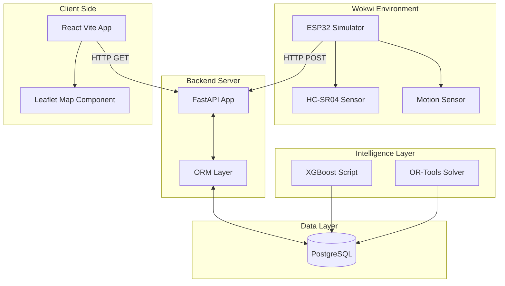

# Component Diagram

```mermaid
graph TD
    subgraph Wokwi Environment
        ESP32[ESP32 Simulator]
        Ultrasonic[HC-SR04 Sensor]
        PIR[Motion Sensor]
        ESP32 --> Ultrasonic
        ESP32 --> PIR
    end

    subgraph Server [Backend Server]
        FastAPI[FastAPI App]
        SQLAlchemy[ORM Layer]
        FastAPI <--> SQLAlchemy
    end

    subgraph Data [Data Layer]
        Postgres[(PostgreSQL)]
        SQLAlchemy <--> Postgres
    end
    
    subgraph AI [Intelligence Layer]
        XGB[XGBoost Script]
        CVRP[OR-Tools Solver]
        XGB --> Postgres
        CVRP --> Postgres
    end

    subgraph Client [Client Side]
        React[React Vite App]
        Leaflet[Leaflet Map Component]
        React --> Leaflet
    end

    ESP32 -- HTTP POST --> FastAPI
    React -- HTTP GET --> FastAPI
```
