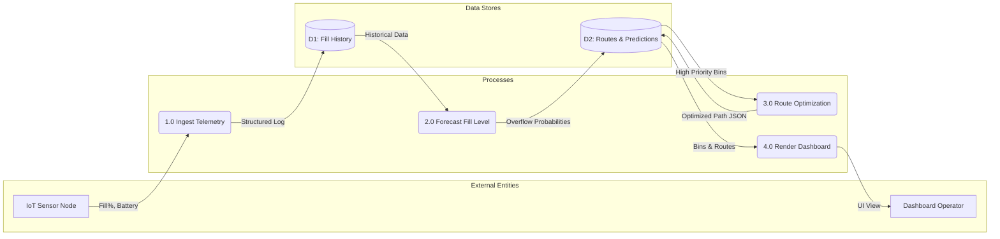

# Data Flow Diagram (DFD)

```mermaid
graph LR
    subgraph External Entities
        Sensor[IoT Sensor Node]
        Operator[Dashboard Operator]
    end

    subgraph Processes
        Ingest(1.0 Ingest Telemetry)
        Predict(2.0 Forecast Fill Level)
        Optimize(3.0 Route Optimization)
        Visualize(4.0 Render Dashboard)
    end

    subgraph Data Stores
        DB_Logs[(D1: Fill History)]
        DB_Routes[(D2: Routes & Predictions)]
    end

    Sensor -- "Fill%, Battery" --> Ingest
    Ingest -- "Structured Log" --> DB_Logs
    DB_Logs -- "Historical Data" --> Predict
    Predict -- "Overflow Probabilities" --> DB_Routes
    DB_Routes -- "High Priority Bins" --> Optimize
    Optimize -- "Optimized Path JSON" --> DB_Routes
    DB_Routes -- "Bins & Routes" --> Visualize
    Visualize -- "UI View" --> Operator
```
