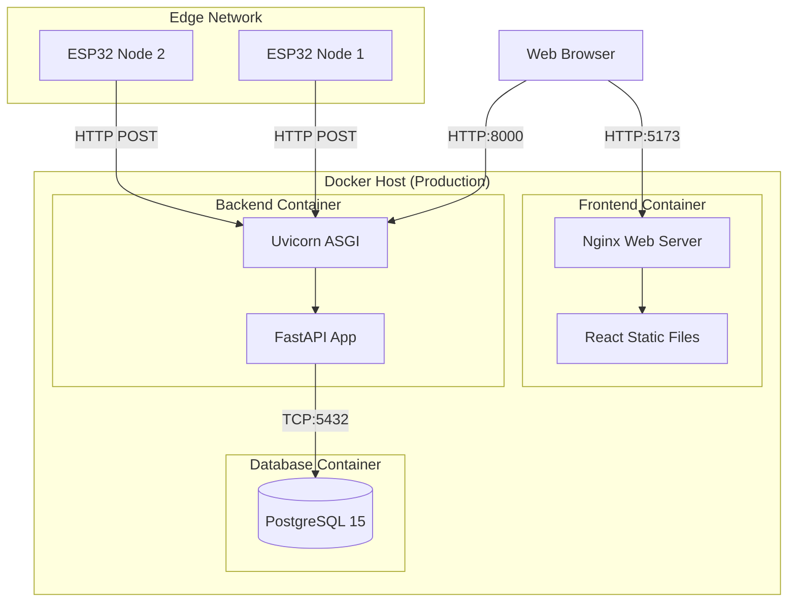

# Deployment Diagram

```mermaid
graph TD
    subgraph "Docker Host (Production)"
        subgraph "Frontend Container"
            Nginx[Nginx Web Server]
            ReactAssets[React Static Files]
            Nginx --> ReactAssets
        end

        subgraph "Backend Container"
            Uvicorn[Uvicorn ASGI]
            FastAPI[FastAPI App]
            Uvicorn --> FastAPI
        end

        subgraph "Database Container"
            Postgres[(PostgreSQL 15)]
        end
    end

    subgraph "Edge Network"
        ESP32_1[ESP32 Node 1]
        ESP32_2[ESP32 Node 2]
    end

    Client[Web Browser] -->|HTTP:5173| Nginx
    Client -->|HTTP:8000| Uvicorn
    ESP32_1 -->|HTTP POST| Uvicorn
    ESP32_2 -->|HTTP POST| Uvicorn
    FastAPI -->|TCP:5432| Postgres
```
