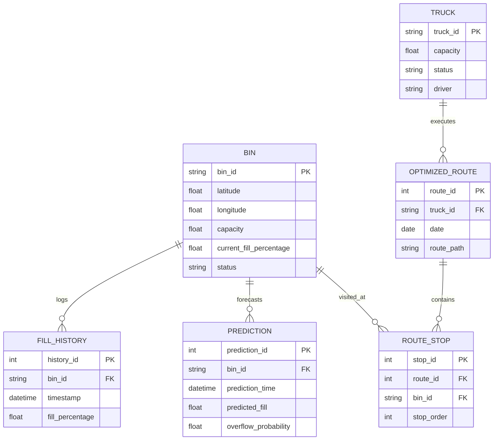

# Entity Relationship (ER) Diagram

```mermaid
erDiagram
    BIN {
        string bin_id PK
        float latitude
        float longitude
        float capacity
        float current_fill_percentage
        string status
    }
    FILL_HISTORY {
        int history_id PK
        string bin_id FK
        datetime timestamp
        float fill_percentage
    }
    PREDICTION {
        int prediction_id PK
        string bin_id FK
        datetime prediction_time
        float predicted_fill
        float overflow_probability
    }
    TRUCK {
        string truck_id PK
        float capacity
        string status
        string driver
    }
    OPTIMIZED_ROUTE {
        int route_id PK
        string truck_id FK
        date date
        string route_path
    }
    ROUTE_STOP {
        int stop_id PK
        int route_id FK
        string bin_id FK
        int stop_order
    }
    
    BIN ||--o{ FILL_HISTORY : "logs"
    BIN ||--o{ PREDICTION : "forecasts"
    BIN ||--o{ ROUTE_STOP : "visited_at"
    TRUCK ||--o{ OPTIMIZED_ROUTE : "executes"
    OPTIMIZED_ROUTE ||--o{ ROUTE_STOP : "contains"
```
