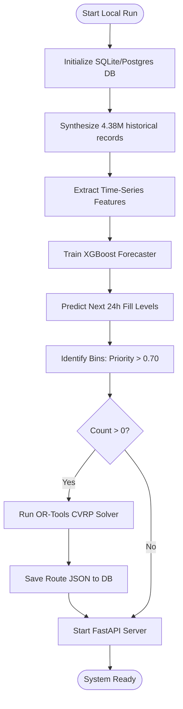

# Flowchart

```mermaid
flowchart TD
    Start([Start Local Run]) --> InitDB[Initialize SQLite/Postgres DB]
    InitDB --> Generate[Synthesize 4.38M historical records]
    Generate --> ExtractFeat[Extract Time-Series Features]
    ExtractFeat --> TrainModel[Train XGBoost Forecaster]
    TrainModel --> Predict[Predict Next 24h Fill Levels]
    Predict --> Identify[Identify Bins: Priority > 0.70]
    
    Identify --> HasHighPriority{Count > 0?}
    HasHighPriority -- Yes --> ORTools[Run OR-Tools CVRP Solver]
    ORTools --> SaveRoute[Save Route JSON to DB]
    SaveRoute --> StartFastAPI
    
    HasHighPriority -- No --> StartFastAPI[Start FastAPI Server]
    StartFastAPI --> End([System Ready])
```
