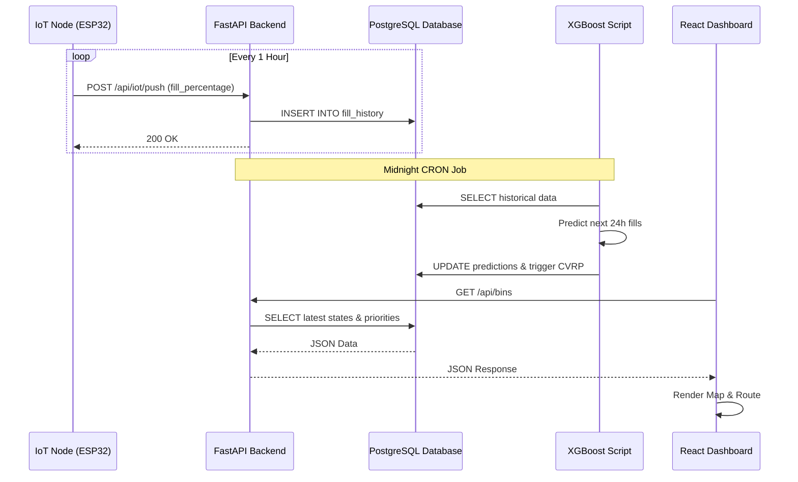

# Sequence Diagram

```mermaid
sequenceDiagram
    participant ESP32 as IoT Node (ESP32)
    participant API as FastAPI Backend
    participant DB as PostgreSQL Database
    participant ML as XGBoost Script
    participant Dash as React Dashboard

    loop Every 1 Hour
        ESP32->>API: POST /api/iot/push (fill_percentage)
        API->>DB: INSERT INTO fill_history
        API-->>ESP32: 200 OK
    end

    Note over API, ML: Midnight CRON Job
    ML->>DB: SELECT historical data
    ML->>ML: Predict next 24h fills
    ML->>DB: UPDATE predictions & trigger CVRP

    Dash->>API: GET /api/bins
    API->>DB: SELECT latest states & priorities
    DB-->>API: JSON Data
    API-->>Dash: JSON Response
    Dash->>Dash: Render Map & Route
```
