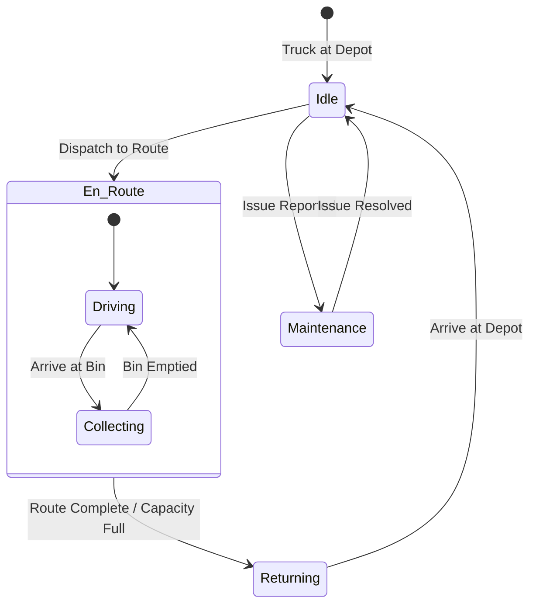

# State Diagram

```mermaid
stateDiagram-v2
    [*] --> Idle: Truck at Depot
    
    Idle --> En_Route: Dispatch to Route
    
    state En_Route {
        [*] --> Driving
        Driving --> Collecting: Arrive at Bin
        Collecting --> Driving: Bin Emptied
    }
    
    En_Route --> Returning: Route Complete / Capacity Full
    Returning --> Idle: Arrive at Depot
    
    Idle --> Maintenance: Issue Reported
    Maintenance --> Idle: Issue Resolved
```
