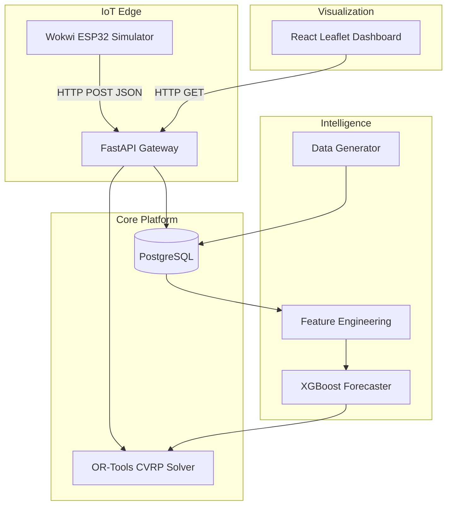

# System Architecture

```mermaid
graph TD
    subgraph IoT Edge
        HW[Wokwi ESP32 Simulator] -->|HTTP POST JSON| API[FastAPI Gateway]
    end

    subgraph Core Platform
        API --> DB[(PostgreSQL)]
        API --> Routing[OR-Tools CVRP Solver]
    end

    subgraph Intelligence
        Sync[Data Generator] --> DB
        DB --> FE[Feature Engineering]
        FE --> Model[XGBoost Forecaster]
        Model --> Routing
    end

    subgraph Visualization
        Dashboard[React Leaflet Dashboard] -->|HTTP GET| API
    end
```
