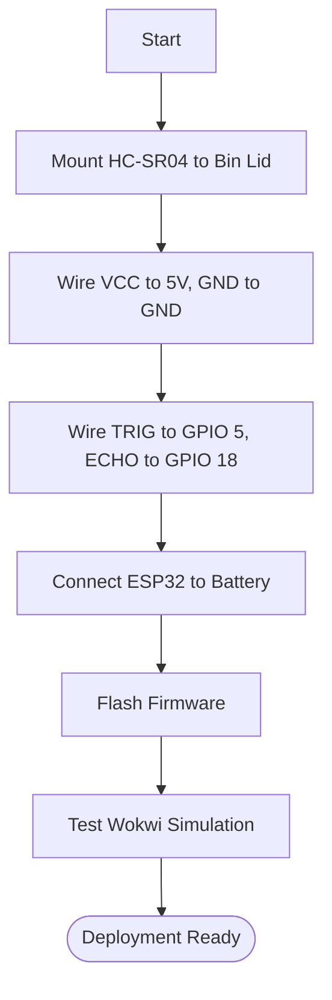

# Assembly Guide (Hardware)

## 1. Assembly Flowchart

## 2. Pinout Configuration Table

| Component | Pin | ESP32 GPIO | Notes |
| :--- | :--- | :--- | :--- |
| **HC-SR04** | VCC | 5V | Requires 5V logic. |
| **HC-SR04** | GND | GND | Common ground. |
| **HC-SR04** | TRIG | 5 | Output pin. |
| **HC-SR04** | ECHO | 18 | Input pin. |
| **I2C LCD** | SDA | 21 | Standard ESP32 I2C. |
| **I2C LCD** | SCL | 22 | Standard ESP32 I2C. |
| **PIR Sensor**| OUT | 27 | Interrupt triggered. |
