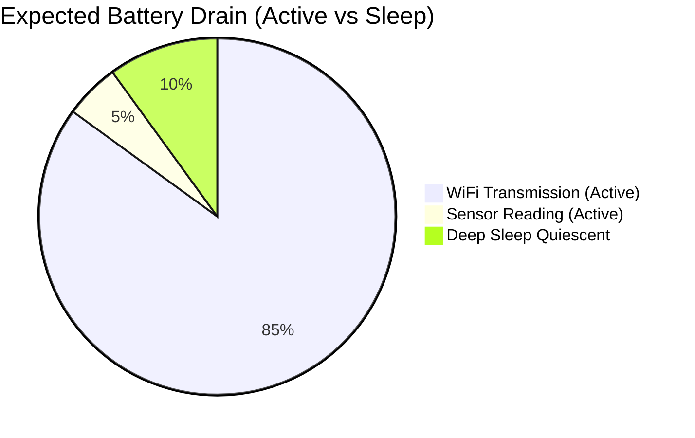

# Power Calculations

## 1. Power Consumption Distribution

## 2. Power Matrix

| Operating Mode | Duration | Current Draw | mAh per hour |
| :--- | :--- | :--- | :--- |
| **Active Mode** | 5 seconds | ~255 mA | `0.35 mAh` |
| **Deep Sleep** | 3595 seconds | ~0.15 mA | `0.15 mAh` |
| **Total Hourly** | 1 Hour | N/A | **`0.50 mAh`** |

### Estimated Lifespan
- **Battery Capacity:** 10,000 mAh (8,000 mAh usable).
- **Hourly Drain:** 0.50 mAh.
- **Lifespan:** `8000 / 0.50 = 16,000 hours` (~666 Days).
