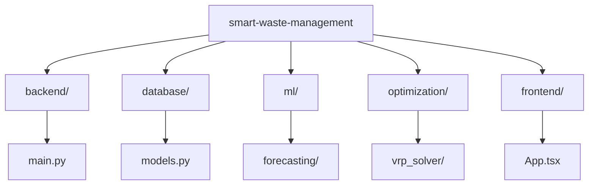

# 06 Source Code

## 1. Codebase Structure

## 2. Primary Modules

| Directory / File | Core Responsibility | Technologies Used |
| :--- | :--- | :--- |
| `backend/main.py` | Exposes REST API endpoints. | FastAPI, Uvicorn |
| `database/models.py` | Defines the ORM schema. | SQLAlchemy, PostgreSQL |
| `ml/forecasting/` | Trains model & predicts fills. | XGBoost, Pandas |
| `optimization/vrp_solver/`| Computes dynamic routes. | Google OR-Tools (C++) |
| `frontend/src/` | Renders map and analytics. | React, TypeScript, Leaflet |
| `run_pipeline.py` | Orchestrates the local demo run. | Python Subprocess |
