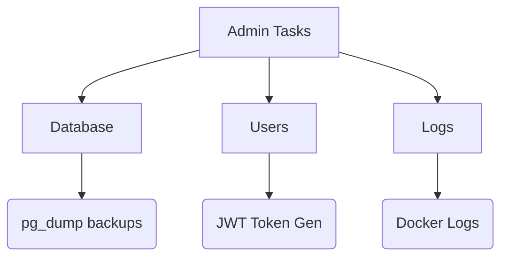

# Admin Manual

## 1. System Administration Flow

## 2. Admin Responsibilities

| Task | Command / Action | Frequency |
| :--- | :--- | :--- |
| **DB Backup** | `docker exec -t ecobin-db pg_dump > backup.sql` | Daily |
| **New User** | `POST /api/users/register` via Swagger UI | As needed |
| **Log Monitor**| `docker-compose logs -f backend` | Weekly |
| **Cert Renew** | `certbot renew --nginx` | Every 90 Days |
