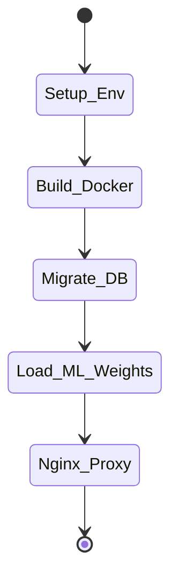

# Deployment Checklist

## 1. Deployment Pipeline

## 2. Pre-Flight Checklist

| Step | Item | Description | Status |
| :--- | :--- | :--- | :--- |
| 1 | **Environment Variables** | `DATABASE_URL` is set to the production Postgres instance. | Pending |
| 2 | **Docker Hub** | Images for `frontend` and `backend` are built and tagged. | Pending |
| 3 | **Database Migration** | SQLAlchemy schema generated (`models.py` matches DB). | Pending |
| 4 | **ML Weights** | Pre-trained XGBoost weights (`model.json`) copied to container. | Pending |
| 5 | **CORS Config** | FastAPI `CORSMiddleware` restricted to frontend domain. | Pending |
| 6 | **SSL/TLS** | Nginx proxy configured with Let's Encrypt SSL. | Pending |
