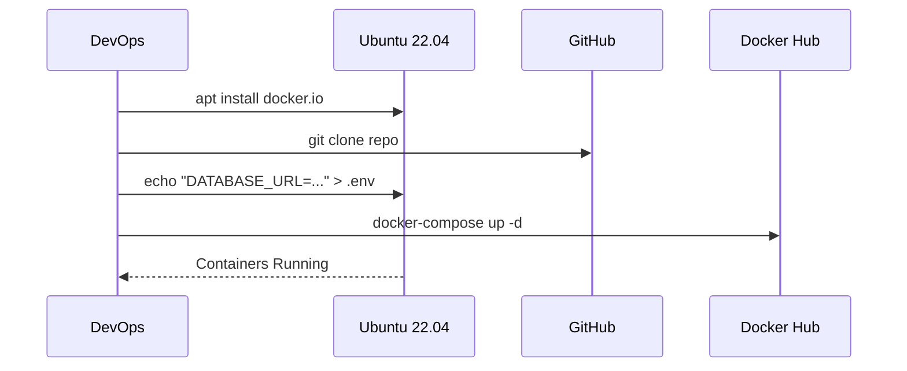

# Installation Guide (Production)

## 1. Installation Sequence

## 2. Command Reference

| Step | Action | Shell Command |
| :--- | :--- | :--- |
| **1** | Install Docker | `sudo apt update && sudo apt install docker.io docker-compose -y` |
| **2** | Clone Repo | `git clone https://github.com/org/smart-waste.git && cd smart-waste` |
| **3** | Config Env | `echo "DATABASE_URL=postgresql://usr:pass@db/waste" > .env` |
| **4** | Spin Up | `sudo docker-compose up -d --build` |
| **5** | Init DB | `sudo docker exec -it <backend_id> python run_pipeline.py` |
