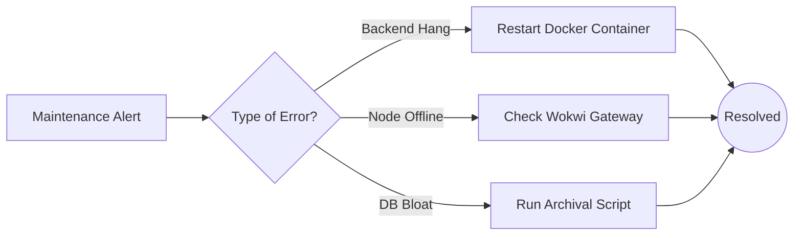

# Maintenance Guide

## 1. Maintenance Workflow

## 2. Troubleshooting Matrix

| Issue | Symptom | Resolution / Command |
| :--- | :--- | :--- |
| **API Hangs** | 502 Bad Gateway / Timeout | `docker-compose restart backend` |
| **Node Offline** | Wokwi slider moves, no data | Restart Wokwi Local Gateway. |
| **DB Bloat** | Storage 95% full | `python migrate_maintenance.py` (Archives to CSV) |
| **Map Blank** | CORS error in browser console | Check `ALLOW_ORIGINS` in `.env`. |
