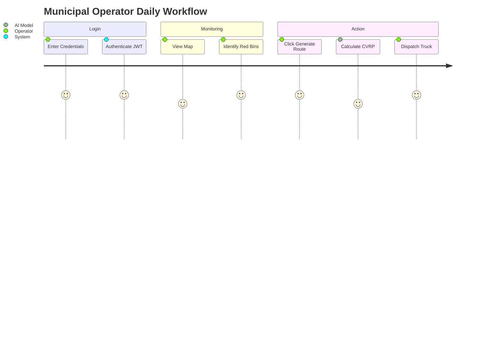

# User Manual

## 1. Dashboard User Journey

## 2. UI Legend

| UI Element | Color / Icon | Meaning | Action Required |
| :--- | :--- | :--- | :--- |
| **Marker** | 🟢 Green | Bin is under 50% capacity. | None. |
| **Marker** | 🔴 Red | Bin > 80% OR predicted to overflow. | Needs routing. |
| **Polyline**| 🔵 Blue Line| The optimized CVRP driving path. | Provide to drivers. |
| **KPI Box** | ⚪ White Panel| Displays "Distance Saved" vs baseline. | Use for weekly reports. |
