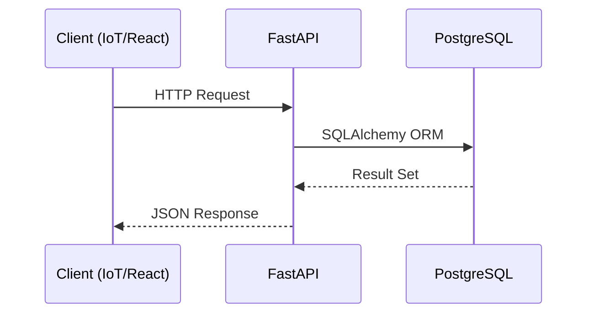

# API Documentation

## 1. Request Flow

## 2. REST Endpoints

| Method | Endpoint | Description | Payload / Response |
| :--- | :--- | :--- | :--- |
| `POST` | `/api/iot/push` | IoT edge node telemetry ingestion. | `{"bin_id": "B1", "fill": 80}` |
| `GET`  | `/api/bins` | Retrieve all bins and prediction statuses. | Array of Bin JSON Objects |
| `GET`  | `/api/routes/latest` | Fetch the optimal path calculated by OR-Tools. | GeoJSON / Polyline Array |
| `GET`  | `/api/analytics` | KPIs (Distance Saved, Fuel Saved). | `{"distance_saved": 33.8}` |
| `POST` | `/api/users/register` | Generate JWT for a new operator. | Auth Token String |
