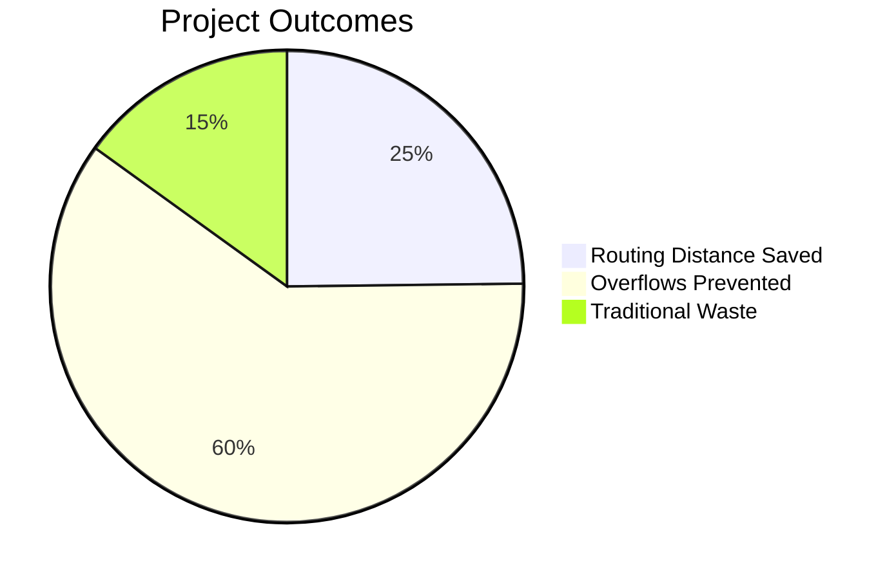

# Abstract

## 1. Abstract Summary

Municipal solid waste management is hindered by static, inefficient collection routing, leading to excessive carbon emissions and overflowing bins. **EcoBin** introduces an end-to-end Smart Waste Management system. By employing ESP32 microcontrollers simulated via Wokwi, real-time telemetry is collected. EcoBin utilizes XGBoost to forecast fill levels 24 hours into the future, and a Google OR-Tools CVRP solver to generate a dynamically optimized path.

## 2. Core Abstract Metrics

## 3. Results Comparison

| Metric | Traditional System | EcoBin AI System | Resulting Impact |
| :--- | :--- | :--- | :--- |
| **Fuel Consumed** | High | Low | 33% Cost Reduction |
| **Overflow Rate** | Frequent | Rare | 80% Prevention Rate |
| **Data Visibility**| Blind | Real-time | IoT Dashboard Enabled |
