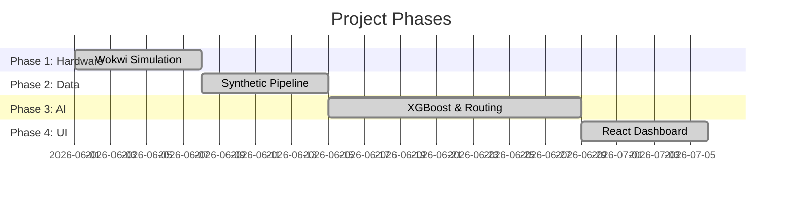

# Project Report

## 1. Phased Execution

## 2. Phase Summaries

| Phase | Focus Area | Technologies | Deliverable |
| :--- | :--- | :--- | :--- |
| **1** | Hardware & IoT | ESP32, C++, Wokwi | Simulated nodes pushing JSON. |
| **2** | Data Pipeline | FastAPI, PostgreSQL | 4.38M synthetic records ingested. |
| **3** | Intelligence | XGBoost, OR-Tools | AI models forecasting and routing. |
| **4** | Visualization | React, Leaflet | Interactive municipal dashboard. |
