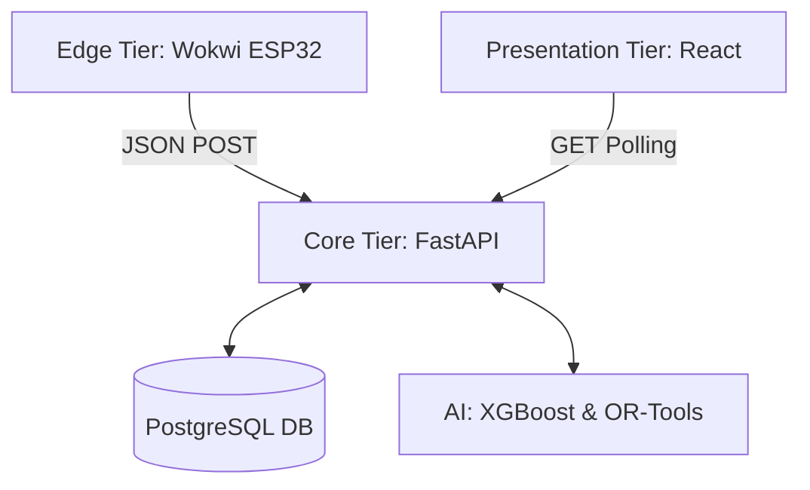

# Software Design Specification (SDS)

## 1. Decoupled 3-Tier Architecture

## 2. Component Specifications

| Component | File / Module | Responsibility |
| :--- | :--- | :--- |
| **Forecaster**| `forecasting.py` | Reads 7-day history, applies XGBoost, outputs `predicted_fill`. |
| **Solver** | `solver.py` | Maps 2D Haversine matrix, applies `CapacityConstraint`, outputs route. |
| **Data Gen** | `generate.py` | Synthesizes 4.38M rows of historical waste data. |
| **Dashboard** | `App.tsx` | Renders the React-Leaflet map and API analytics. |
