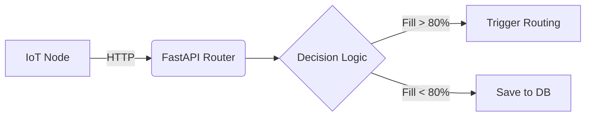

# Software Requirements Specification (SRS)

## 1. System Context Diagram

## 2. Logical Requirements

| Req Type | Specific Requirement | Motivation |
| :--- | :--- | :--- |
| **Logic** | Flag bin for collection if forecast > 80%. | Prevent overflow proactively. |
| **Logic** | Routing engine bypasses bins < 40% capacity. | Reduce fuel by ignoring empty bins. |
| **Database**| Use SQLAlchemy for DB Agnosticism. | Allow dev in SQLite and prod in Postgres. |
| **Database**| Index `bin_id` and `timestamp` columns. | Speed up XGBoost historical queries. |
