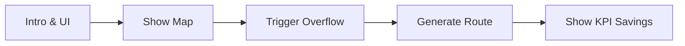

# Demo Script

## 1. Presentation Flow

## 2. Script & Actions

| Time | Speaker Script | On-Screen Action |
| :--- | :--- | :--- |
| **0:00** | "Welcome to the EcoBin demonstration. Here is the dashboard." | Open `localhost:5173`. |
| **0:30** | "Notice the red bins. XGBoost predicts these will overflow today." | Click on a red map marker. |
| **1:00** | "Instead of fixed routing, let's let the AI generate a path." | Click the **Generate Route** button. |
| **1:30** | "Google OR-Tools instantly maps a route respecting truck limits." | Point to the blue polyline drawn. |
| **2:00** | "This dynamic routing saved us 48km compared to fixed schedules!"| Point to the KPI Analytics panel. |
