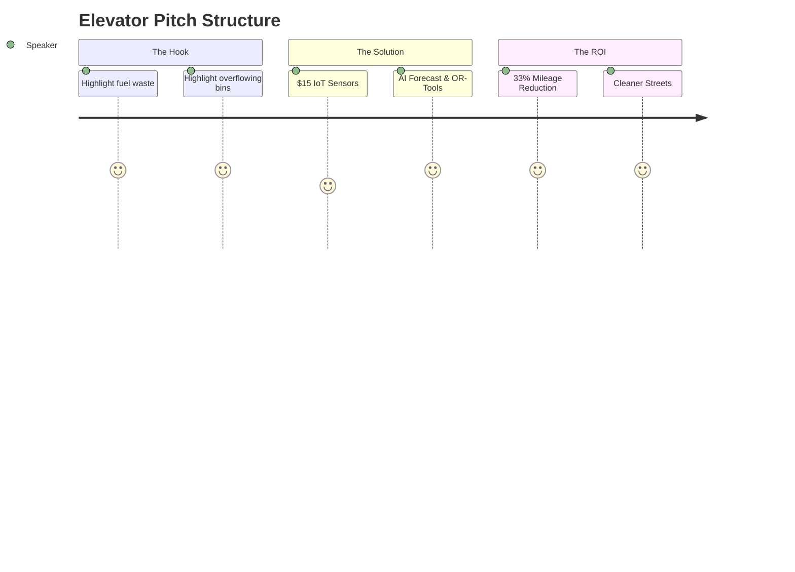

# Elevator Pitch

## 1. The Core Pitch

"Cities burn millions in fuel sending garbage trucks to empty bins, while bins in busy areas overflow. **EcoBin** fixes this. We use $15 retrofittable IoT sensors to track bin levels, and an AI forecasting model to predict exactly when a bin will overflow. We then use Google's routing algorithms to generate an optimized daily path. We reduce fleet mileage by 33%, cut carbon emissions, and eliminate overflowing trash—saving cities money while keeping the streets clean."

## 2. Pitch Flow (Visualized)

## 3. Key Pitch Metrics

| Metric | Pitch Talking Point |
| :--- | :--- |
| **Hardware Cost** | $15 per retrofitted bin (ESP32 + Ultrasonic). |
| **Fuel Savings** | 33% guaranteed reduction in daily route distance. |
| **Sanitation** | 80% reduction in overflow events via XGBoost. |
