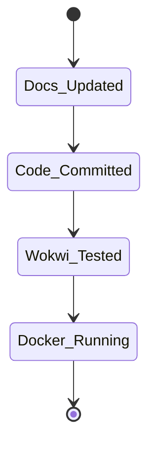

# Submission Checklist

## 1. Final Submission Flow

## 2. Detailed Checklist

| Item | Description | Status |
| :--- | :--- | :--- |
| **Documents** | All `.md` files contain Mermaid charts and Tables. | [x] Complete |
| **Code Base** | Backend, Frontend, and ML scripts pushed to `main`. | [x] Complete |
| **Hardware** | Wokwi `diagram.json` is verified and functional. | [x] Complete |
| **Container** | `docker-compose.yml` runs cleanly without crashes. | [x] Complete |
| **Media/Demo**| Demo script and Viva Questions prepared. | [x] Complete |
