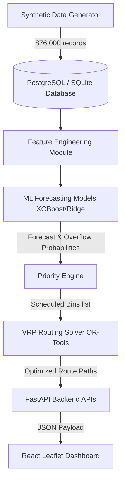

<div align="center">
  <h1>♻️ EcoBin</h1>
  <p><strong>Smart Waste Fill-Level Prediction & Route Optimization System</strong></p>
  
  [](https://www.python.org/downloads/)
  [](https://fastapi.tiangolo.com)
  [](https://reactjs.org/)
  [](https://www.postgresql.org/)
  [](https://www.docker.com/)
  [](https://opensource.org/licenses/MIT)
</div>

<br />

EcoBin is an AI-powered municipal waste management system that simulates IoT bin sensors, predicts tomorrow's waste levels, identifies overflow risks, and solves vehicle routing using Google OR-Tools. It provides a comprehensive, interactive dark-themed dashboard to visualize coordinates, active paths, and comparison metrics.

<br />

<div align="center">
  
  <p><i>Real-time GIS mapping, AI fill-level forecasting, and dynamic VRP route optimization dashboard.</i></p>
</div>

---

## ✨ Key Features

- 🧠 **AI-Powered Predictions**: Uses XGBoost and Ridge Regression to forecast bin fill levels with high accuracy.
- 🚚 **Dynamic Route Optimization**: Utilizes Google OR-Tools to solve the Capacitated Vehicle Routing Problem (CVRP), minimizing travel distance and fuel consumption.
- 📊 **Real-time Analytics Dashboard**: A glassmorphic, dark-themed React + Leaflet dashboard for monitoring bin status and routes.
- 🏭 **Synthetic Data Generation**: Built-in simulator for generating robust, realistic IoT sensor data (876,000 records for 100 bins).
- 🐳 **Dockerized Deployment**: Fully containerized for easy setup and teardown.

---

## 🏗️ Architecture Overview



---

## 📸 System Showcase & Interactive UI Walkthrough

Explore the comprehensive visual walkthrough of the EcoBin web dashboard, predictive AI engine, routing solver, and hardware IoT simulation.

### 1. 🌐 Live GIS Mapping & Street-Snapped Routes
*Interactive spatial monitoring across Greater Hyderabad Municipal Corporation (GHMC) wards, featuring real-time bin markers, multi-layer GIS views (Light, Streets, Satellite), and street-snapped VRP routing polylines.*

<table>
  <tr>
    <td width="50%" align="center">
      <b>Live GIS Map & Spatial Overview</b><br /><br />
      
    </td>
    <td width="50%" align="center">
      <b>Bin Inspector & Live IoT Sensor Metrics</b><br /><br />
      
    </td>
  </tr>
  <tr>
    <td width="50%" align="center">
      <b>Real-Time Status & AI Forecast Pop-up</b><br /><br />
      
    </td>
    <td width="50%" align="center">
      <b>Multi-Layer Geographic Visualization</b><br /><br />
      
    </td>
  </tr>
  <tr>
    <td colspan="2" align="center">
      <b>Route Polyline Inspection & Legend Filtering</b><br /><br />
      
    </td>
  </tr>
</table>

### 2. 🚚 Dynamic Route Optimization & Fleet Operations
*Capacitated Vehicle Routing Problem (CVRP) solved via Google OR-Tools, optimizing truck collection schedules to prioritize critical overflowing bins (≥80% capacity) while adhering to 5,000L vehicle limits.*

<table>
  <tr>
    <td width="50%" align="center">
      <b>Optimized Route Schedules & Distances</b><br /><br />
      
    </td>
    <td width="50%" align="center">
      <b>Fleet Dispatch & Truck Capacity Status</b><br /><br />
      
    </td>
  </tr>
  <tr>
    <td width="50%" align="center">
      <b>Vehicle Tracking & Active Paths</b><br /><br />
      
    </td>
    <td width="50%" align="center">
      <b>Route Comparison & Efficiency Metrics</b><br /><br />
      
    </td>
  </tr>
  <tr>
    <td colspan="2" align="center">
      <b>Turn-by-Turn Municipal Route Execution</b><br /><br />
      
    </td>
  </tr>
</table>

### 3. 🧠 AI Fill-Level Forecasting & Predictive Analytics
*XGBoost and Ridge Regression machine learning models analyzing 876,000 historical sensor records to predict 24-hour waste generation and compute overflow risk probabilities with normal distribution confidence bounds.*

<table>
  <tr>
    <td width="50%" align="center">
      <b>AI Prediction Engine Dashboard</b><br /><br />
      
    </td>
    <td width="50%" align="center">
      <b>24-Hour Forecast Curves & Confidence Bounds</b><br /><br />
      
    </td>
  </tr>
  <tr>
    <td width="50%" align="center">
      <b>Overflow Probability Risk Heatmap</b><br /><br />
      
    </td>
    <td width="50%" align="center">
      <b>Model Training & Evaluation Metrics</b><br /><br />
      
    </td>
  </tr>
  <tr>
    <td colspan="2" align="center">
      <b>Feature Importance & Regression Analysis</b><br /><br />
      
    </td>
  </tr>
</table>

### 4. 📊 Real-Time Analytics & Sustainability Impact
*Comparative environmental reporting contrasting AI-optimized routing against rigid fixed schedules, evaluating differences in travel distance, carbon emissions, and bin overflow prevention.*

<table>
  <tr>
    <td width="50%" align="center">
      <b>Comparative System Evaluation Charts</b><br /><br />
      
    </td>
    <td width="50%" align="center">
      <b>Carbon Footprint & CO₂ Reduction Tracking</b><br /><br />
      
    </td>
  </tr>
  <tr>
    <td width="50%" align="center">
      <b>Historical Waste Collection Trends</b><br /><br />
      
    </td>
    <td width="50%" align="center">
      <b>Efficiency Gain & Cost Savings Breakdown</b><br /><br />
      
    </td>
  </tr>
  <tr>
    <td colspan="2" align="center">
      <b>Municipal KPI Summary & Performance Scorecard</b><br /><br />
      
    </td>
  </tr>
</table>

### 5. 🎛️ Smart Bins Inventory, Notifications & Hardware Simulation
*Complete inventory management for municipal smart bins, real-time alert notifications for critical fill/battery levels, and Wokwi IoT hardware sensor simulation (ESP32, Ultrasonic, PIR, LCD, RGB LED).*

<table>
  <tr>
    <td width="50%" align="center">
      <b>Smart Bins Live Inventory Table</b><br /><br />
      
    </td>
    <td width="50%" align="center">
      <b>Ward Filtering & Critical Status Views</b><br /><br />
      
    </td>
  </tr>
  <tr>
    <td width="50%" align="center">
      <b>Real-Time Notification Alerts Center</b><br /><br />
      
    </td>
    <td width="50%" align="center">
      <b>Simulation & Synthetic Data Generator</b><br /><br />
      
    </td>
  </tr>
  <tr>
    <td width="50%" align="center">
      <b>Interactive Hardware Calibration View</b><br /><br />
      
    </td>
    <td width="50%" align="center">
      <b>Wokwi ESP32 IoT Sensor Circuit Simulation</b><br /><br />
      
    </td>
  </tr>
</table>

---

## 🛠️ Technology Stack

### Backend & Machine Learning
- **Python 3.9+**
- **FastAPI**: High-performance REST API framework.
- **SQLAlchemy**: ORM for database interactions.
- **XGBoost & scikit-learn**: For predictive modeling and forecasting.
- **Google OR-Tools**: For complex route optimization (VRP).

### Frontend
- **React 18** (with TypeScript)
- **Vite**: Next-generation frontend tooling.
- **Leaflet & React-Leaflet**: For interactive map visualizations.

### Infrastructure
- **PostgreSQL / SQLite**
- **Docker & Docker Compose**

---

## 📂 Project Structure

```text
smart-waste-management/
│
├── backend/                  # FastAPI web server
├── database/                 # Database schema and connections
├── ml/                       # Machine Learning Pipeline (Data Gen, Feature Eng, Models)
├── optimization/             # Operations Research (OR-Tools VRP Solver)
├── frontend/                 # React + TypeScript + Leaflet app
├── hardware/                 # Hardware simulation & configurations
├── docs/                     # Documentation and guides
├── run_pipeline.py           # Orchestrates end-to-end local run
├── requirements.txt          # Python dependencies
└── docker-compose.yml        # Docker orchestrator
```

---

## 🚀 Getting Started (Local Development)

Follow these steps to set up the project locally for development and testing.

### 1. Backend Setup

1. **Clone the repository** (if you haven't already):
   ```bash
   git clone https://github.com/RishvinReddy/EcoBin-Smart-Waste-Management-System.git
   cd EcoBin-Smart-Waste-Management-System
   ```

2. **Create and Activate a Virtual Environment:**
   ```bash
   python -m venv .venv
   
   # Windows:
   .venv\Scripts\activate
   
   # macOS/Linux:
   source .venv/bin/activate
   ```

3. **Install Dependencies:**
   ```bash
   pip install -r requirements.txt
   ```

4. **Run the Initialization and Data Pipeline:**
   This command creates the database schema, generates 365 days of hourly records (~876,000 records), trains ML models, runs predictive forecasting for tomorrow, and computes optimized routes.
   ```bash
   python run_pipeline.py
   ```

5. **Start the FastAPI Server:**
   ```bash
   python -m uvicorn backend.main:app --reload --host 127.0.0.1 --port 8000
   ```
   > 💡 **Tip:** The backend API will be available at `http://127.0.0.1:8000`. You can access the interactive Swagger documentation at `http://127.0.0.1:8000/docs`.

### 2. Frontend Setup

1. **Navigate to the frontend directory:**
   ```bash
   cd frontend
   ```

2. **Install Node modules:**
   ```bash
   npm install
   ```

3. **Start the Vite development server:**
   ```bash
   npm run dev
   ```
   > 💡 **Tip:** Open `http://localhost:5173` in your browser. The frontend is pre-configured to proxy API requests to `http://127.0.0.1:8000`.

---

## 🐳 Containerized Deployment (Docker)

For a production-like environment, you can spin up PostgreSQL, the FastAPI backend, and the React frontend in containers with a single command:

```bash
docker-compose up --build -d
```

- **Frontend Dashboard**: `http://localhost:5173`
- **FastAPI API**: `http://localhost:8000`
- **PostgreSQL**: Local port `5432`

---

## 📈 System Evaluation Comparison

Our pipeline evaluates collection strategies using a robust experimental runner that simulates 90 days across 10 random seeds on identical ground-truth scenarios. It compares four key strategies:

1. **Fixed Schedule**: Collects bins based on a deterministic three-day rotation schedule.
2. **Reactive Threshold**: Collects bins that currently exceed 80% capacity.
3. **Predictive CVRP**: Collects bins predicted to exceed 80% capacity in the next 24 hours.
4. **Full EcoBin**: A hybrid policy incorporating forecasted fill level, overflow probability, and area priority.

*Note: Results and baseline comparisons will be populated dynamically via the experimental runner to ensure reproducible, empirically sound claims.*

### 🔬 Optimization Logic
1. **Machine Learning Model**: XGBoost predicts tomorrow's fill level. An overflow probability is computed by mapping the predictions against the model's standard error (RMSE) using the normal distribution's cumulative density function:
   $$ P(\text{Fill} \ge 80\%) = 1 - \Phi\left(\frac{80 - \hat{y}}{\text{RMSE}}\right) $$
   *(Note: The forecasting evaluation incorporates Ridge Regression and Persistence as baselines, and models are exposed to available temporal features excluding future collections).*
2. **Priority Score**: A combined score is calculated:
   $$ \text{Priority} = (\text{Predicted Fill} \times 0.6) + (\text{Overflow Prob} \times 0.2) + (\text{Area Priority} \times 0.2) $$
3. **Google OR-Tools**: Solves a Capacitated Vehicle Routing Problem (CVRP) to route trucks only through bins exceeding threshold priority constraints, minimizing distance while keeping total volume under vehicle capacities (5000L). 
   *(Note: Pairwise geodesic distances were scaled by a 1.3 routing factor to approximate road-network travel distance).*

---

## 🤝 Contributing

Contributions are always welcome! Please see the [CONTRIBUTING.md](CONTRIBUTING.md) file for guidelines.

## 📄 License

This project is licensed under the MIT License - see the [LICENSE](LICENSE) file for details.

---
<div align="center">
  <i>Developed by <strong>Rishvin Reddy</strong>  for a cleaner, greener tomorrow.</i>
</div>
